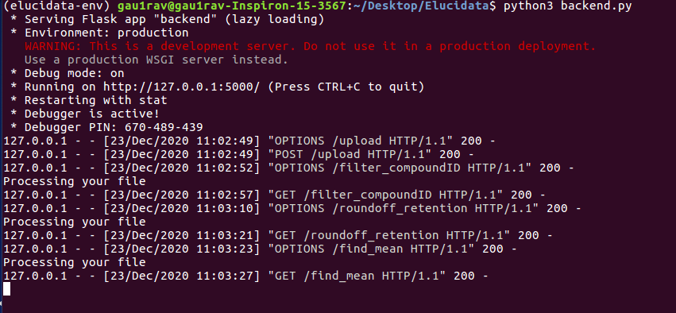

# Backend-Process-files
Flask server for Process files web app which allows clients to upload files and perform several queries(tasks) on them. The server is configured to run on port 5000.
Refer to the image attached for a visual represntation of the running server:

## Steps to run the server

###### Clone the repo
`git clone https://github.com/gau1rav/Backend-Process-files`

###### Create a new virtual environment (Optional but Recommended)
Following commands can be used to create a new virtual environment using python3

`python3 -m pip install --user virtualenv`\
`python3 -m venv <env_name>`

Activate the virtual environment and go to the directory where the repo is cloned

###### Install dependencies
`pip install -r requirements.txt`

###### Start server
`python3 backend.py`

## Learn more
Learn more about virtual environments from [Virtual env documentation](https://docs.python.org/3.9/library/venv.html).
